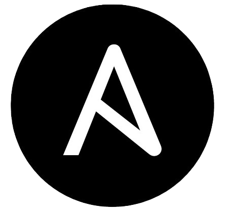
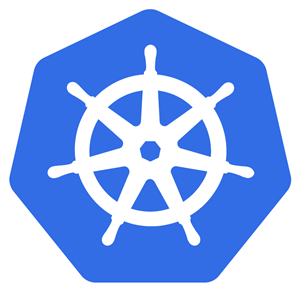

## Hi there, Welcome to my GitHub 👋 
### About Me
I am Jasvitha Buggana, a dedicated Software Development Engineer with over 3 years of experience at leading technology companies like **Infosys** and **Unisys**. Throughout my career, I have had the privilege of collaborating with esteemed clients such as **HSBC**, **Wells Fargo** and **DNB**. My work primarily focuses on automating CI/CD pipelines, developing machine learning modules, creating innovative features to reduce manual effort, and resolving complex bugs to enhance system efficiency.

I am passionate about leveraging technology to solve real-world problems and continuously strive to learn and apply new skills. My goal is to contribute to innovative projects that push the boundaries of what's possible in software development.

### Exploring Opportunities:
I'm actively seeking roles in **Machine Learning Engineer**, **MLOps**, **Site Reliability Engineer (SRE)**, and **DevOps Engineer**. Let's innovate and build the future together!

## Projects:
- [Telecom Customer Churn Prediction](https://github.com/jasvithaBuggana/Telecom-Customer-Churn-Prediction) - EDA, Data Visualization, ML models( K-NN, Decision Tree, Random Forest Trees, Logistic Regression)
- [Real Estate Price Prediction](https://github.com/jasvithaBuggana/Real-Estate-Price-Prediction-) - Data Cleaning, Web scraping, Regression Model
- [NCDC ClimateRecords BigData Analytics](https://github.com/jasvithaBuggana/NCDC-ClimateRecords-Big-Data-Analytics) - Python, Hadoop, Hive, Pig
- [Integrating AWS DevOps CI/CD Pipeline](https://github.com/jasvithaBuggana/Integrating-AWS-DevOps-CI-CD-Pipeline-) - AWS services (S3, EC2, CodeCommit, CodeBuild, CodeDeploy, Codepipeline)

### Skills and Technologies:
         

## Contact: 
- Email: jasvitha.engineer@gmail.com
- [Jasvitha Buggana's LinkedIn](https://www.linkedin.com/in/jasvitha-buggana/)
- [Portfolio](https://jasvithabuggana.github.io/Portfolio/index.html)

<!--
**jasvithaBuggana/JasvithaBuggana** is a ✨ _special_ ✨ repository because its `README.md` (this file) appears on your GitHub profile.

Here are some ideas to get you started:

- 🔭 I’m currently working on ...
- 🌱 I’m currently learning ...
- 👯 I’m looking to collaborate on ...
- 🤔 I’m looking for help with ...
- 💬 Ask me about ...
- 📫 How to reach me: ...
- 😄 Pronouns: ...
- ⚡ Fun fact: ...
-->
